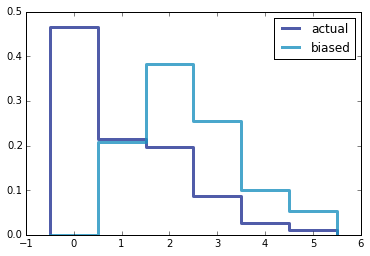

[Think Stats Chapter 3 Exercise 1](http://greenteapress.com/thinkstats2/html/thinkstats2004.html#toc31) (actual vs. biased)

The problem asks us to explore the class size paradox if you survey 
survey children and ask how many children are in their family

Below is the result where biased is if you ask the child how many children are in the family 
vs the actual number of children in the family

The non biased pmf mean is 1.024 but the biased mean in 2.4; almost double.

Helper Code:
    
    def BiasPmf(pmf, label=''):
        """Returns the Pmf with oversampling proportional to value.
    
        If pmf is the distribution of true values, the result is the
        distribution that would be seen if values are oversampled in
        proportion to their values; for example, if you ask students
        how big their classes are, large classes are oversampled in
        proportion to their size.
    
        Args:
          pmf: Pmf object.
          label: string label for the new Pmf.
    
         Returns:
           Pmf object
        """
        new_pmf = pmf.Copy(label=label)
    
        for x, p in pmf.Items():
            new_pmf.Mult(x, x)
            
        new_pmf.Normalize()
        return new_pmf

    def pmf_mean(pmf):
        mean_val =np.sum(num*pmf_prob for num,pmf_prob in pmf.Items() )
        return mean_val

    def pmf_var(pmf):
        mean_val=pmf_mean(pmf)
        var=np.sum ( pmf_prob * np.square(num-mean_val) for num,pmf_prob in pmf.Items())
        return var

Actual code
    
    pmf = thinkstats2.Pmf(resp.numkdhh,label='actual')
    biasedPMF=BiasPmf(pmf,label='biased')
    thinkplot.PrePlot(2)
    thinkplot.Pmfs([pmf, biasedPMF])
    thinkplot.Show()
    print("Non biased pmf mean ",pmf_mean(pmf))
    print("biased pmf mean ",pmf_mean(biasedPMF))

[Code](http://nbviewer.ipython.org/github/npatta01/ThinkStats2/blob/master/code/chap03ex.ipynb)