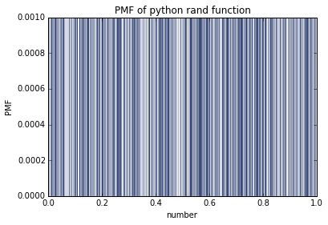
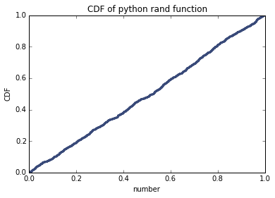

[Think Stats Chapter 4 Exercise 2](http://greenteapress.com/thinkstats2/html/thinkstats2005.html#toc41) (a random distribution)

#Problem
Exercise 2   The numbers generated by random.random are supposed to be uniform between 0 and 1; that is, every value in the range should have the same probability.
Generate 1000 numbers from random.random and plot their PMF and CDF. Is the distribution uniform?

#Code

## imports

    %matplotlib inline
    
    import thinkstats2
    import thinkplot
    import random
    
## Generate a sample of size 1000 
    samples = [random.random() for _ in range(1000)]
    
## Pmf
    pmf = thinkstats2.Pmf(samples)
    thinkplot.Pmf(pmf, linewidth=0.1)
    thinkplot.Show(xlabel='number', ylabel='PMF', title='PMF of python rand function')

    
    
## Cdf
    cdf = thinkstats2.Cdf(samples)
    thinkplot.Cdf(cdf)
    thinkplot.Show(xlabel = 'number', ylabel = 'CDF')
    
    
# Analysis

If a sample is uniform, the probability of each element should be about the same.

There are 1000 numbers being selected form the range of 0 to 1. If each number is likely to appear, they should each have probability
1/1000.

## PMF

If you plot the pmf of a uniform distribution as a bar graph for every x value, you should see a y value of 0.01   

## CDF

If you plot the cdf a uniform distribution, the graph should show a linear relationship

