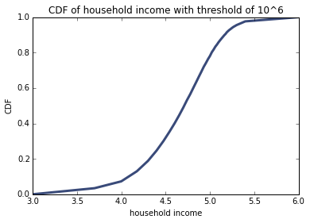
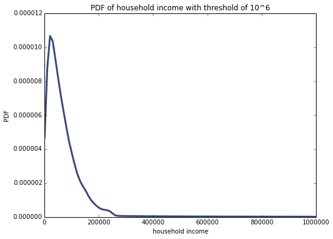
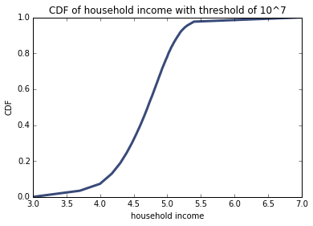
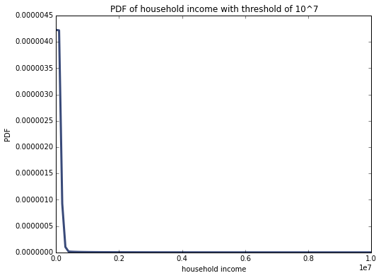

[Think Stats Chapter 6 Exercise 1](http://greenteapress.com/thinkstats2/html/thinkstats2007.html#toc60) (household income)

# Problem

The distribution of income is famously skewed to the right. In this exercise, we’ll measure how strong that skew is.

InterpolateSample generates a pseudo-sample; that is, a sample of household incomes that yields the same number of respondents in each range as the actual data. It assumes that incomes in each range are equally spaced on a log10 scale.

Compute the median, mean, skewness and Pearson’s skewness of the resulting sample. What fraction of households reports a taxable income below the mean? How do the results depend on the assumed upper bound?

# Code/Analysis
## Imports

    %matplotlib inline
    import numpy as np
    import density
    import hinc
    import hinc2
    import thinkplot
    import thinkstats2

## Read data

    df = hinc.ReadData()
    
## Assuming max income is 10^6

###Sample
    log_sample_a = hinc2.InterpolateSample(df, log_upper=6.0)
    
### CDF    
    log_cdf = thinkstats2.Cdf(log_sample_a)
    thinkplot.Cdf(log_cdf)
    thinkplot.Show(xlabel='household income',
                   ylabel='CDF', title='CDF of household income with threshold of 10^6')

### Summary Stats
    
    sample = np.power(10, log_sample_a)
    mean, median = density.Summarize(sample)
    

(Output)
    
    mean 74278.7075312
    std 93946.9299635
    median 51226.4544789
    skewness 4.94992024443
    pearson skewness 0.736125801914

    
### Percent of people below the mean    
    cdf = thinkstats2.Cdf(sample)
    print('cdf[mean]', cdf[mean])
    
(Output)

    cdf[mean] 0.660005879567

### PDF    
    pdf = thinkstats2.EstimatedPdf(sample)
    thinkplot.Pdf(pdf)
    thinkplot.Show(xlabel='household income',
                   ylabel='PDF',title='PDF of household income with threshold of 10^6')
                   
                   
                   
                   

## Assuming max income is 10^7

###Sample
    log_sample_b = hinc2.InterpolateSample(df, log_upper=7.0)
    
### CDF    
    log_cdf = thinkstats2.Cdf(log_sample_b)
    thinkplot.Cdf(log_cdf)
    thinkplot.Show(xlabel='household income',
                   ylabel='CDF', title='CDF of household income with threshold of 10^7')

### Summary Stats
    
    sample = np.power(10, log_sample_b)
    mean, median = density.Summarize(sample)
    

(Output)
    
    mean 124267.397222
    std 559608.501374
    median 51226.4544789
    skewness 11.6036902675
    pearson skewness 0.391564509277
 
    
### Percent of people below the mean    
    cdf = thinkstats2.Cdf(sample)
    print('cdf[mean]', cdf[mean])
    
(Output)

    cdf[mean] 0.856563066521

### PDF    
    pdf = thinkstats2.EstimatedPdf(sample)
    thinkplot.Pdf(pdf)
    thinkplot.Show(xlabel='household income',
                   ylabel='PDF',title='PDF of household income with threshold of 10^6')
                   
                   
                   
                   

# More Analysis
The pearson skewness and skewness are both positive, indicating a right skewed distribution.
Another way to tell that a distribution is rightly skewed is that the median is less than the median.

As the upperbound increases, the mean increases from ~ 74,000 to ~ 124,000.
As the upperbound increases, the std increases from ~ 93,000 to ~ 559,000.

So, both the mean and std are affeced by the outliers (high salaries).
The pearson median skewness slightly decreases from 0.7 to 0.3