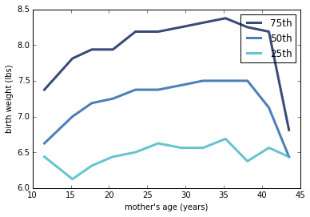
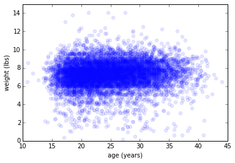

[Think Stats Chapter 7 Exercise 1](http://greenteapress.com/thinkstats2/html/thinkstats2008.html#toc70) (weight vs. age)

# Problem
Using data from the NSFG, make a scatter plot of birth weight versus mother’s age. 
Plot percentiles of birth weight versus mother’s age. 
Compute Pearson’s and Spearman’s correlations. 
How would you characterize the relationship between these variables?

# Code/Analysis

## imports

    %matplotlib inline      
    import sys      
    import numpy as np      
    import math     
    import first        
    import thinkplot        
    import thinkstats2      

## data

    live, firsts, others = first.MakeFrames()
    live = live.dropna(subset=['agepreg', 'totalwgt_lb'])
    
## Bin by age and percentile of weights

    bins = np.arange(10, 48, 3)
    indices = np.digitize(live.agepreg, bins)
    groups = live.groupby(indices)
    
## Plot

    ages = [group.agepreg.mean() for i, group in groups]
    cdfs = [thinkstats2.Cdf(group.totalwgt_lb) for i, group in groups]
    
    
    thinkplot.PrePlot(3)
    for percent in [75, 50, 25]:
        weights = [cdf.Percentile(percent) for cdf in cdfs]
        label = '%dth' % percent
        thinkplot.Plot(ages, weights, label=label)
    
    thinkplot.Show(
                   xlabel="mother's age (years)",
                   ylabel='birth weight (lbs)')
                   

## age/weight

    ages = live.agepreg
    weights = live.totalwgt_lb
    
    
## Scatter
    
    thinkplot.Scatter(ages, weights, alpha=0.1)
    thinkplot.Config(xlabel='age (years)',
                     ylabel='weight (lbs)',
                     xlim=[10, 45],
                     ylim=[0, 15],
                     legend=False)
                     
                     
                     
    
    
    
## Correlation
 
 
    print('Corr', thinkstats2.Corr(ages, weights))
    print('SpearmanCorr', 
          thinkstats2.SpearmanCorr(ages, weights))
          
          
   (Output)
   
    Corr 0.0688339703541
    SpearmanCorr 0.0946100410966 