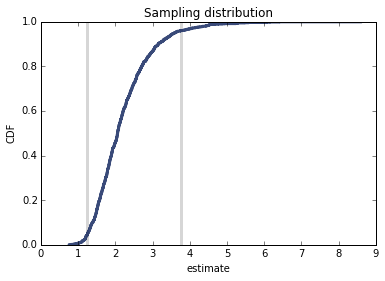

[Think Stats Chapter 8 Exercise 2](http://greenteapress.com/thinkstats2/html/thinkstats2009.html#toc77) (scoring)

# Problem

Suppose you draw a sample with size n=10 from an exponential distribution with ?=2. 
Simulate this experiment 1000 times and plot the sampling distribution of the estimate L. 
Compute the standard error of the estimate and the 90% confidence interval.

# Code

## Values of exponential distribution

lam: parameter of an exponential distribution   
n: sample size      
m: number of iterations     

    lam=2           
    n=10
    m=1000

## Calculate lamhat

    estimates = []
    for j in range(m):
        xs = np.random.exponential(1.0/lam, n)
        lamhat = 1.0 / np.mean(xs)
        estimates.append(lamhat)

## Stderr

    stderr = RMSE(estimates, lam)
    print('standard error', stderr)

standard error 0.8475077785652102

## Calculate the cdf

    cdf = thinkstats2.Cdf(estimates)
    low_ci,high_ci= cdf.Percentile(5), cdf.Percentile(95)
    
## Plot the Confidence interval    
    print('confidence interval', ci)
    # plot two points at (low confidence interval,0) and (low confidence interval,1) 
    thinkplot.Plot([low_ci, low_ci], [0, y], color='0.8', linewidth=3)
    # plot two points at (high confidence interval,0) and (high confidence interval,1)
    thinkplot.Plot([high_ci, high_ci], [0, y], color='0.8', linewidth=3)

## plot the CDF

    thinkplot.Cdf(cdf)
    thinkplot.Show(xlabel='estimate',
               ylabel='CDF',
               title='Sampling distribution')
               
               
