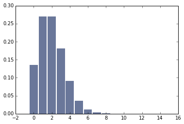
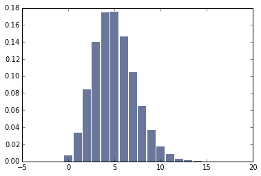
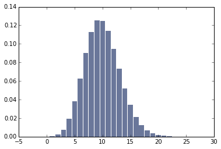

# 4) Think Stats Exercise 8.3

Problem: [Think Stats Chapter 8 Exercise 3](http://greenteapress.com/thinkstats2/html/thinkstats2009.html#toc77)

---

# Problem
In games like hockey and soccer, the time between goals is roughly exponential. So you could estimate a team’s goal-scoring rate by observing the number of goals they score in a game. This estimation process is a little different from sampling the time between goals, so let’s see how it works.
Write a function that takes a goal-scoring rate, lam, in goals per game, and simulates a game by generating the time between goals until the total time exceeds 1 game, then returns the number of goals scored.

Write another function that simulates many games, stores the estimates of lam, then computes their mean error and RMSE.

Is this way of making an estimate biased? Plot the sampling distribution of the estimates and the 90% confidence interval. What is the standard error? What happens to sampling error for increasing values of lam?

# Code / Analysis

## Helper function that simulates game 

    def SimulateGame(lam):
        """Simulates a game and returns the estimated goal-scoring rate.
    
        lam: actual goal scoring rate in goals per game
        """
        goals = 0
        t = 0
        while True:
            time_between_goals = random.expovariate(lam)
            t += time_between_goals
            if t > 1:
                break
            goals += 1
    
        # estimated goal-scoring rate is the actual number of goals scored
        L = goals
        return L

## Function to simulate many games

    def Estimate(lam=2, m=1000000):
    
        estimates = []
        for i in range(m):
            L = SimulateGame(lam)
            estimates.append(L)
    
        print('rmse L', RMSE(estimates, lam))
        print('mean error L', MeanError(estimates, lam))
        
        pmf = thinkstats2.Pmf(estimates)
    
        cdf = thinkstats2.Cdf(estimates)
        ci = cdf.Percentile(5), cdf.Percentile(90)
    
        print('Ci (%s,%s)'%(ci))
        thinkplot.Hist(pmf)
        thinkplot.Show()
        
        
## Simulate the game with different scores of lam

### Estimate(lm=2)

rmse L 1.4134259796678423    
mean error L 0.002563     
Ci (0,4)      

### Estimate(lm=5)

rmse L 2.2363883830855498     
mean error L 0.000189      
Ci (2,9)     

### Estimate(lm=10)

rmse L 3.1599356006096073      
mean error L -0.002951     
Ci (5,15)     

As the lam parameter increases, the rmse, mean error and Ci increases
 
## Different values of m for lam2

    |m              |     RMSE L        |  Mean Error  | Confidence Interval    |
    | ------------- |:-------------:    | -----------: |---------------------:  |
    | 10            |1.449137674618944  |  -0.3        | 0,4                    |
    | 50            |1.3416407864998738 |  0            |0,4                    |
    | 100           |1.3601470508735443 |  -0.17        |0,4                    |
    | 500           |1.4198591479439078 | -0.044        |0,4                    |
    | 1000          |1.4049911031746785 | -0.017        |   0,4                 |
    
    
   The mean error is small and also decreases with m, so this estimator appears to be unbiased